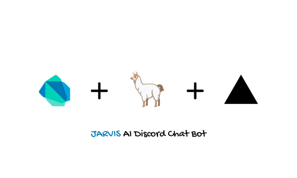

### JARVIS AI Discord Bot 💬🤖


>   🎯 This is your personal assistant AI discord bot written in Dart.
>
>   🎯 Backend is written in Express Js and powered by Meta LLAMA 2 70Billion AI chat model🦙🦙 and hosted on Vercel.


#### Overview 🪸

**JARVIS** is an AI Discord Chat bot. See Usage guide for more.


AI Chat server home page: https://discord-ai-bot-server.vercel.app/

Bot invitation link : https://discord-ai-bot-server.vercel.app/invite


#### Usage Guide 🔬

🔗 Via Invitation Link

​	If you use the invitation link, add the bot to your server after authorization.

​	💡 At the moment, my bot is not hosted on any platform but on local server, so if I don't run it, my bot will stay **offline** forever. I'm planning and choosing it to host and run on a cloud platform. So, bear with me. 


🦽 Via Manual Installation

​	Please see the **Installation Guide** section. 


##### 💬💬 Commands

​	In order to conversation with JARVIS, you'll have to mention it in every prompt. 

​	For example:

```prompt
@Jarvis Tell me about yourself.
```


#### Installation Guide ⚙️


1.   Clone the project: `git clone https://github.com/YeLwinOo-Steve/jarvis-discord-bot.git`
2.   Create a bot from Discord Developer Portal: https://discord.com/developers
     1.   For reference: https://discordpy.readthedocs.io/en/stable/discord.html
3.   Add bot to your server.
4.   Create a key file in project root directory: `secrets/discord_bot.key`
5.   Run your bot using: `dart run` or `dart lib/discord_bot.dart` 

😉 That's it! Your bot should be **online** now!

#### LICENSE 🪪


```LICENSE
Copyright (c) 2024 Ye Lwin Oo

Permission is hereby granted, free of charge, to any person obtaining
a copy of this software and associated documentation files (the
"Software"), to deal in the Software without restriction, including
without limitation the rights to use, copy, modify, merge, publish,
distribute, sublicense, and/or sell copies of the Software, and to
permit persons to whom the Software is furnished to do so, subject to
the following conditions:

The above copyright notice and this permission notice shall be
included in all copies or substantial portions of the Software.

THE SOFTWARE IS PROVIDED "AS IS", WITHOUT WARRANTY OF ANY KIND,
EXPRESS OR IMPLIED, INCLUDING BUT NOT LIMITED TO THE WARRANTIES OF
MERCHANTABILITY, FITNESS FOR A PARTICULAR PURPOSE AND
NONINFRINGEMENT. IN NO EVENT SHALL THE AUTHORS OR COPYRIGHT HOLDERS BE
LIABLE FOR ANY CLAIM, DAMAGES OR OTHER LIABILITY, WHETHER IN AN ACTION
OF CONTRACT, TORT OR OTHERWISE, ARISING FROM, OUT OF OR IN CONNECTION
WITH THE SOFTWARE OR THE USE OR OTHER DEALINGS IN THE SOFTWARE.
```


